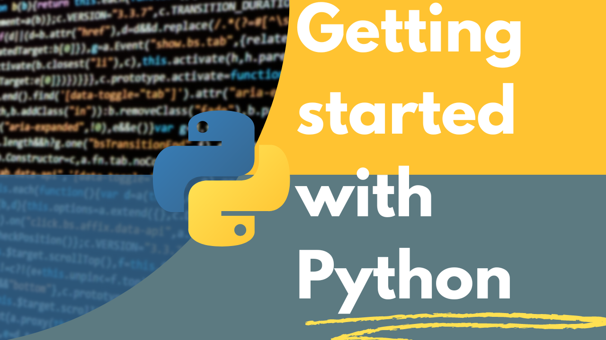

# Python Course - What I Learned

Simple overview of online Python programming course exercises and projects.
[**Playlist Classes Python Setup**](https://www.youtube.com/playlist?list=PLvE-ZAFRgX8hnECDn1v9HNTI71veL3oW0)

## What I Learned

### Basic Stuff
- Variables (numbers, text)
- Input and output (`input()`, `print()`)
- Math operations

### Loops and Conditions
- **For loops** - repeat things a certain number of times
- **While loops** - repeat until something happens
- **If statements** - make decisions in code

### Data Types
- **Lists** - store multiple items, can change them
- **Tuples** - store multiple items, can't change them  
- **Dictionaries** - store data with names (like a phonebook)

### Functions
- Make my own functions with `def`
- Use functions that come with Python
- **Modules**: `random`, `datetime`, `time`

### Working with Text
- Cut up text, check letters
- Validate user input

## Projects I Made

1. **Countdown Timer** - counts down from 10 to 0
2. **Lottery Number Picker** - picks random numbers for Mega Sena
3. **Player Stats** - saves football player information
4. **Worker Registration** - calculates retirement age
5. **Parentheses Checker** - checks if math expressions are correct
6. **Palindrome Checker** - sees if words read the same backwards
7. **Dice Game** - rolls dice and ranks players

